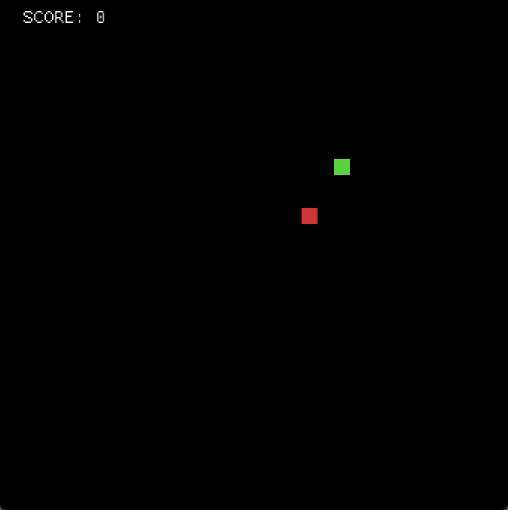

  
  <h1>snake</h1>
  <small>
    🐍 Snake Game made with Rust's Macroquad crate
  </small>

## Demo

  

## Controls

You can use either Arrow Keys or WASD to change snake direction.

## Contributions

All kind of contributions are welcome, feel free to open a Pull Request or
Issue if you find it helpful.
